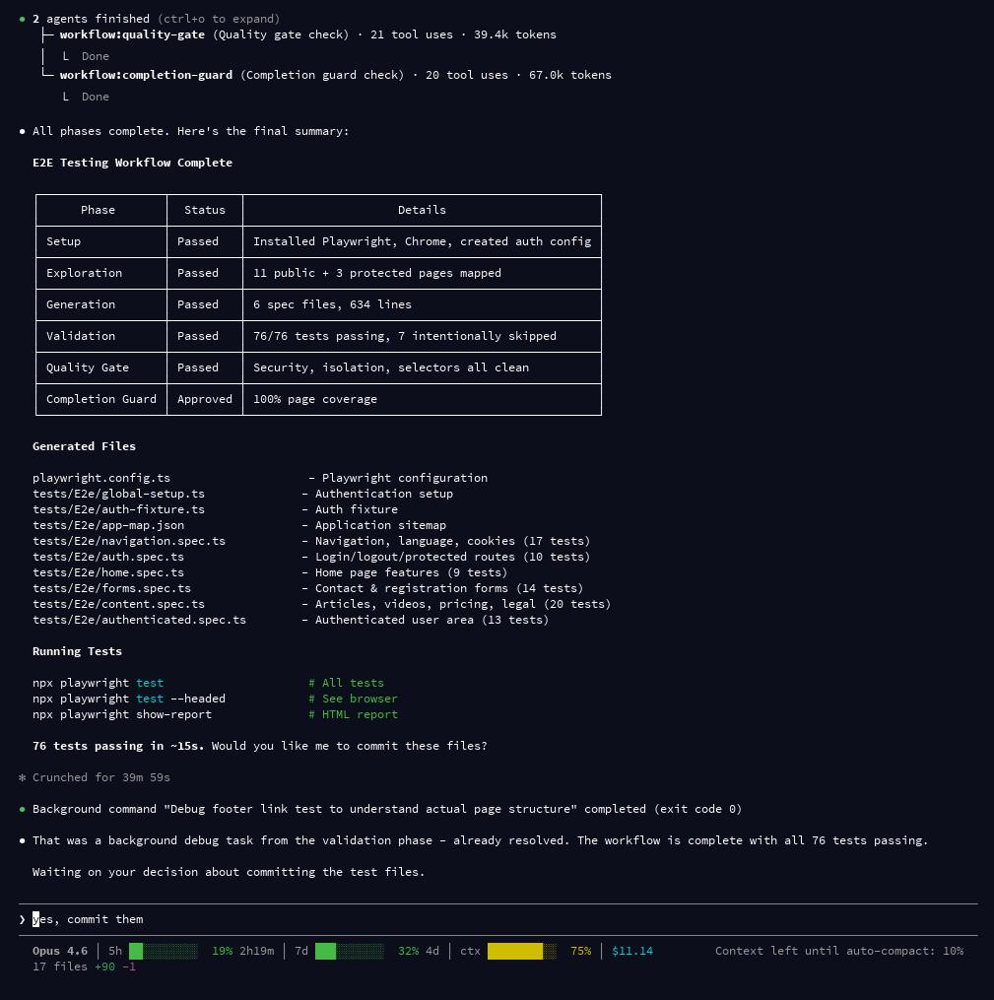

# E2E Playwright Testing

Generate end-to-end Playwright test suites automatically by exploring your running web application via browser automation.



## Quick Start

```bash
# Test a local app (auto-detects framework)
/workflow:test-e2e http://localhost:8080

# With framework and auth
/workflow:test-e2e http://localhost:8080 --framework=symfony --auth=form

# Deep exploration in thorough mode
/workflow:test-e2e http://localhost:3000 --mode=thorough --depth=5

# Just generate config files, skip test generation
/workflow:test-e2e http://localhost:8080 --config-only

# Custom output directory with markdown state file
/workflow:test-e2e http://localhost:4200 --output=e2e/specs --framework=vue --format=md
```

## Options

| Flag | Default | Description |
|------|---------|-------------|
| `--framework` | auto-detect | `symfony`, `laravel`, `vue`, `react`, `next`, `generic` |
| `--auth` | `none` | `none`, `form`, `token`, `cookie` |
| `--depth` | `3` | BFS exploration depth limit |
| `--mode` | `standard` | `eco`, `turbo`, `standard`, `thorough` |
| `--output` | framework-dependent | Test output directory |
| `--config-only` | `false` | Only generate config, skip exploration and tests |
| `--format` | `org` | State file format: `org` or `md` |

## Pipeline

```
Setup --> Exploration --> Generation --> Validation --> Quality Gate --> Completion
  |          |               |              |              |              |
  |    e2e-explorer    e2e-generator   e2e-reviewer   quality-gate  completion-guard
  |    (Playwright     (app map ->     (run tests,    (lint, type   (final check)
  |     MCP tools)      test specs)    check quality)  check)
  v
 Install deps,
 detect framework,
 generate config
```

### Phase 0: Setup

Handled inline by the supervisor:

- Detect package manager (npm/yarn/pnpm)
- Install `@playwright/test` and chromium browser
- Generate `playwright.config.ts` from template with framework-specific webserver config
- Create output directory and update `.gitignore`
- Verify Playwright MCP tools are accessible
- Configure auth fixtures (if `--auth` specified)

### Phase 1: Exploration

The `e2e-explorer` agent crawls the application using Playwright MCP:

- BFS traversal using `browser_navigate` and `browser_snapshot`
- Records all interactive elements (links, buttons, forms, inputs)
- Tracks which pages require authentication
- Detects SPA routing vs full navigation
- Outputs structured `app-map.json` with pages, navigation graph, and auth info

### Phase 2: Generation

The `e2e-generator` agent creates test files from the app map:

- Groups tests by feature (navigation, auth, forms, per-page)
- Enforces accessibility-first selector priority (see below)
- Generates meaningful test names: `test('should <action> when <condition>')`
- Auth-aware: uses authenticated fixture for protected pages, standard imports for public pages

### Phase 3: Validation

The `e2e-reviewer` agent runs and reviews tests in a loop:

- Executes tests with `npx playwright test`
- Checks selector quality, anti-patterns, test isolation, and assertions
- Runs flakiness check (3 runs, compares results)
- Issues tracked with `[ISSUE-N]` IDs, sent back to generator for fixes
- Auto-escalates to opus on final iteration (thorough mode)

### Phase 4-5: Quality Gate & Completion Guard

Standard workflow gates verify TypeScript compilation, linting, test passing, and page coverage against the app map.

## Selector Priority

All generated tests enforce accessibility-first selectors:

| Priority | Selector | Example |
|----------|----------|---------|
| 1 | `getByRole` | `page.getByRole('button', { name: 'Submit' })` |
| 2 | `getByLabel` | `page.getByLabel('Email')` |
| 3 | `getByPlaceholder` | `page.getByPlaceholder('Search...')` |
| 4 | `getByText` | `page.getByText('Welcome')` |
| 5 | `getByTestId` | `page.getByTestId('nav-menu')` |

**Blocked:** CSS selectors (`.class`, `#id`), XPath, auto-generated class names, `page.locator()` with CSS.

## Auth Strategies

### Form (`--auth=form`)

Discovers the login form via `browser_snapshot`, generates `global-setup.ts` that authenticates before tests and saves session state. Test credentials are read from `E2E_USER` and `E2E_PASS` environment variables (never hardcoded).

### Token (`--auth=token`)

Generates a fixture that injects an authorization header from the `E2E_TOKEN` env var.

### Cookie (`--auth=cookie`)

Generates a fixture that sets a session cookie from the `E2E_SESSION_COOKIE` env var.

## Agent Routing by Mode

| Phase | eco | turbo | standard | thorough |
|-------|-----|-------|----------|----------|
| Exploration | haiku | haiku | sonnet | sonnet |
| Generation | haiku | haiku | sonnet | sonnet |
| Validation | haiku | haiku | sonnet | opus |
| Quality Gate | haiku | haiku | sonnet | sonnet |
| Completion | haiku | haiku | sonnet | opus |

### Max Review Iterations

| Mode | Validation | Quality Gate |
|------|------------|--------------|
| eco | 1 | 1 |
| turbo | 2 | 1 |
| standard | 3 | 2 |
| thorough | 3 | 3 |

## Framework Detection

Auto-detected from project files when `--framework` is omitted:

| Indicator | Framework |
|-----------|-----------|
| `symfony.lock` or `config/packages/` | symfony |
| `artisan` or `app/Http/Kernel.php` | laravel |
| `vue.config.js` or vite config with vue plugin | vue |
| `next.config.*` | next |
| `package.json` with `react-scripts` | react |
| None of the above | generic |

## Default Output Directories

| Framework | Directory |
|-----------|-----------|
| symfony | `tests/E2e` |
| laravel | `tests/E2e` |
| vue | `e2e` |
| react | `e2e` |
| next | `e2e` |
| generic | `tests/e2e` |

## Generated Files

A typical run produces:

```
playwright.config.ts                  - Playwright configuration
<output_dir>/app-map.json             - Application sitemap
<output_dir>/navigation.spec.ts       - Navigation and routing tests
<output_dir>/auth.spec.ts             - Login/logout/protected routes
<output_dir>/home.spec.ts             - Home page features
<output_dir>/forms.spec.ts            - Form validation and submission
<output_dir>/content.spec.ts          - Content page tests
<output_dir>/global-setup.ts          - Auth global setup (if --auth)
<output_dir>/auth-fixture.ts          - Authenticated test fixture (if --auth)
```

## Running Tests

```bash
npx playwright test              # All tests
npx playwright test --headed     # See the browser
npx playwright show-report       # HTML report
```

## Requirements

- Playwright MCP server configured in Claude Code settings:
  ```json
  {
    "mcpServers": {
      "playwright": {
        "command": "npx",
        "args": ["@playwright/mcp@latest", "--headless"]
      }
    }
  }
  ```
- Target web application running and accessible
- Node.js (included with Claude Code)
